# Exercise 1: Setting Up Python Development Environment

## Table of Contents
1. [Installing Python](#installing-python)
2. [Creating a Virtual Environment](#creating-a-virtual-environment)
3. [Creating a Python Script](#creating-a-python-script)
4. [Setting Up IPython Shell](#setting-up-ipython-shell)
5. [Exporting a Requirements File](#exporting-a-requirements-file)

### 1. Installing Python

Begin by installing Python version 3.8.7 on your system. To confirm your Python version, execute the command `python --version` in your terminal.

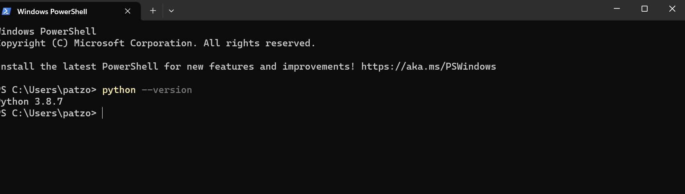

### 2. Creating a Virtual Environment

Create a new virtual environment named "cf-python-base." 

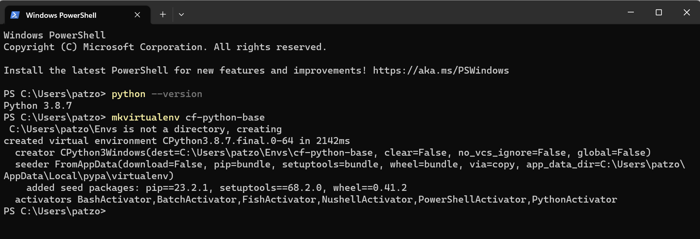

### Creating a Python Script

Install a text editor like Visual Studio Code or any other of your preference. Create a Python script named "add.py." This script will take two user-input numbers, add them, and display the result. Below is a template for your Python script:

```python
# Get input from the user
a = int(input("Enter the first number: "))
b = int(input("Enter the second number: "))

# Add the numbers
c = a + b

# Print the result
print("The sum of {} and {} is: {}".format(a, b, c))
```

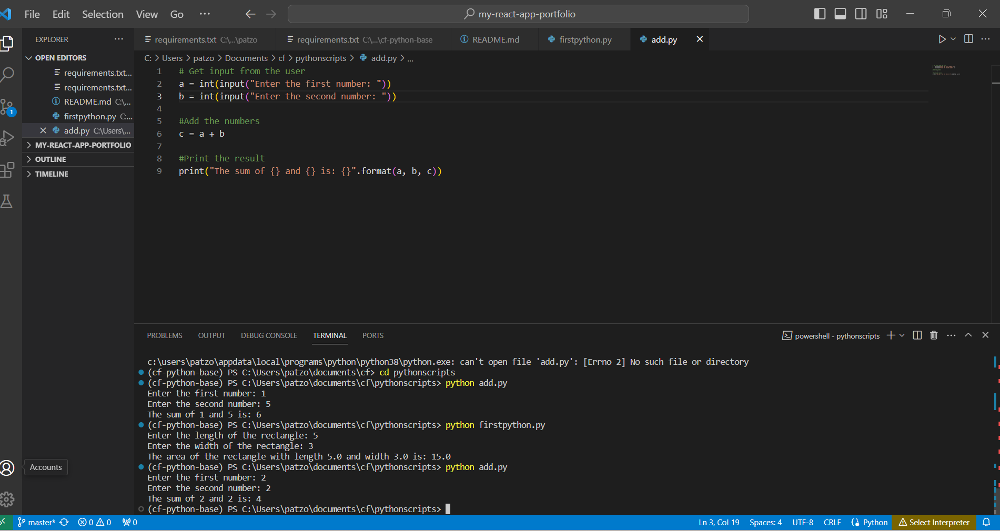

### Setting Up IPython Shell

Establish an IPython shell within the "cf-python-base" virtual environment. IPython provides a more feature-rich Python interactive shell, including syntax highlighting, auto-indentation, and advanced auto-complete features. 

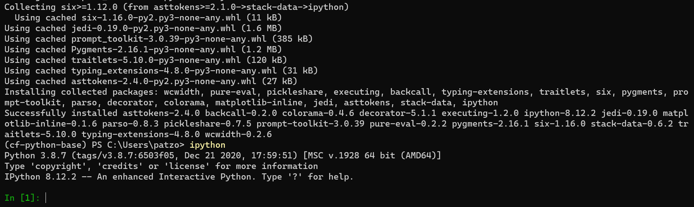

### Exporting a Requirements File

Generate a "requirements.txt" file from your current environment, listing all the installed packages and their versions. Then, create a new environment named "cf-python-copy" and install the packages from the "requirements.txt" file.

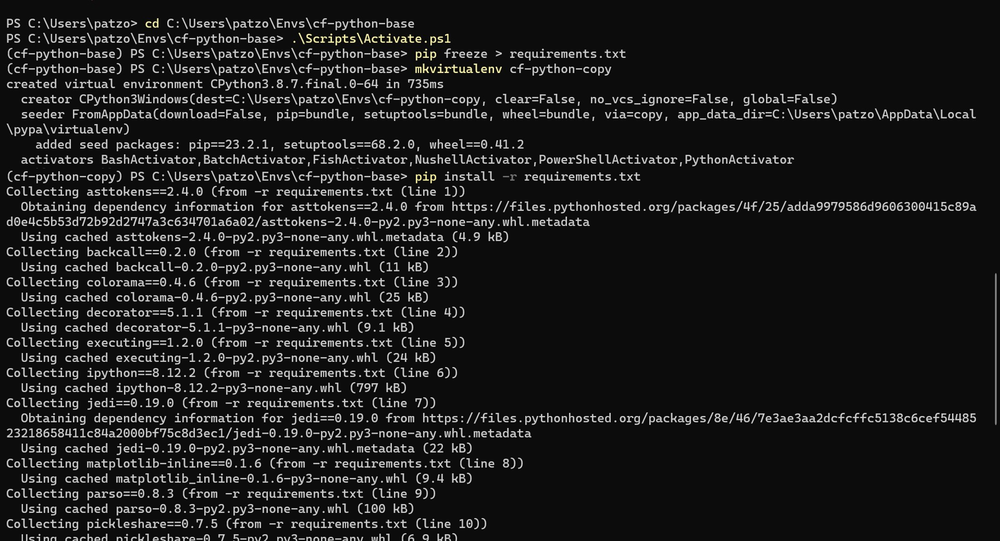

# Exercise 2

## Table of Contents

1. [Create the Data Structure](#create-the-data-structure)
2. [Create `recipe_1`](#create-recipe_1)
3. [Create Outer Structure](#create-outer-structure)
4. [Create 4 More Recipes](#create-4-more-recipes)
5. [Print Ingredient Lists](#print-ingredient-lists)

### Create the Data Structure

```python
# Define the structure for `recipe_1`
recipe_1 = {
    'name': 'Recipe 1',
    'cooking_time': 45,  # Replace with the actual cooking time
    'ingredients': ['Ingredient 1', 'Ingredient 2', 'Ingredient 3']  # Replace with actual ingredients
}
```

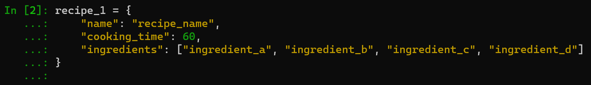

A dictionary is chosen for its key-value structure, aligning with the need to associate attributes with the recipe. It allows easy access to information via keys and accommodates various data types. This structure fosters organization and consistency, ideal for storing multiple recipes in a list, simplifying data manipulation and analysis.

### Create `recipe_1`

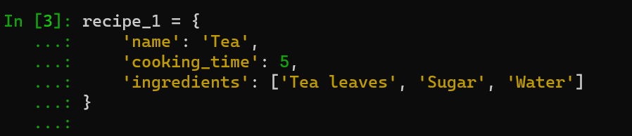

### Create Outer Structure

Create an outer structure called all_recipes.

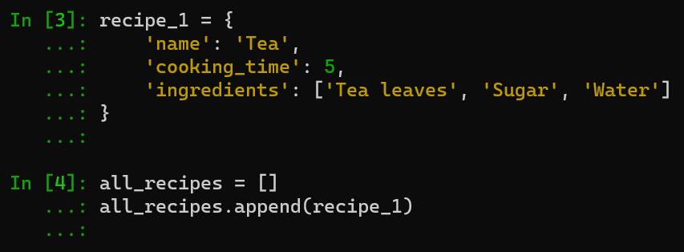

Using a list provides a sequential and dynamic structure, allowing easy modification and retrieval of recipes based on their order. Lists support iteration and indexing, enabling convenient operations on individual recipes or the entire collection. The versatility of lists accommodates recipes of varying lengths and complexities, making it suitable for a diverse range of recipe structures. Overall, a list provides the flexibility, scalability, and ease of access required for managing and modifying multiple recipes.

### Create 4 More Recipes

Generate 4 more recipes as `recipe_2`, `recipe_3`, `recipe_4`, and `recipe_5`, and add them to `all_recipes`.

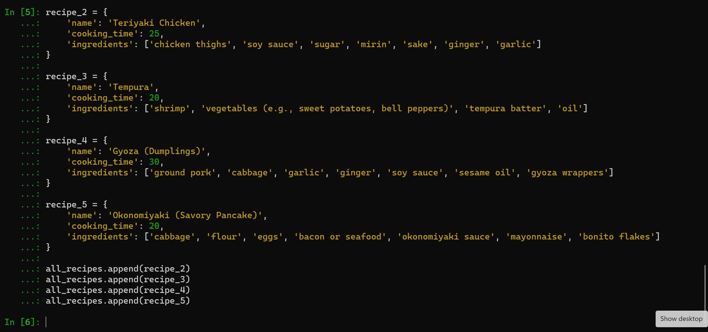

### Print Ingredient Lists

Print the ingredients of each recipe.

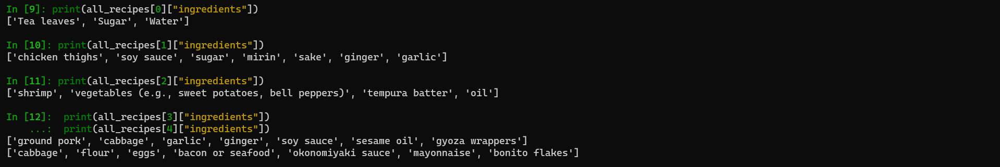
or
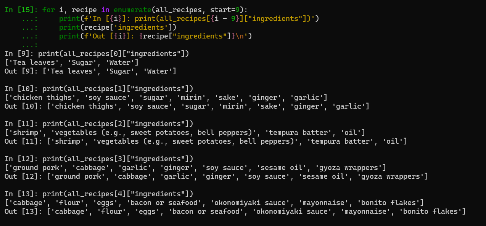

# Exercise 3

## Table of Contents
1. [Create a New Python Script](#create-a-new-python-script)
2. [Initialize Two Empty Lists](#initialize-two-empty-lists)
3. [Define a Function](#define-a-function)
4. [Get The Number of New Recipes](#get-the-number-of-new-recipes)
5. [Check Ingredients and Add Recipes](#check-ingredients-and-add-recipes)
6. [Assign Difficulty Levels and Display Recipes](#assign-difficulty-levels-and-display-recipes)
7. [Display All Ingredients](#display-all-ingredients)
8. [Output](#output)

### Create a New Python Script
Open a Python script in an editor of your choice and name it "exercise_1.3.py".

### Initialize Two Empty Lists
Begin by initializing two empty lists: `recipes_list` and `ingredients_list`.

```python

#Empty lists storing recipes and ingredients
recipes_list = [] # List to store recipe dictionaries
ingredients_list = [] # List to store ingredients
```

### Define a Function
Create a function called `take_recipe` that takes user input for the following variables:
- `name` (str): Stores the name of the recipe.
- `cooking_time` (int): Stores the cooking time (in minutes).
- `ingredients` (list): A list to store ingredients, each of the string data type.
- `recipe` (dictionary): Store the `name`, `cooking_time`, and `ingredients` variables in a dictionary (e.g., `recipe = {'name': name, 'cooking_time': cooking_time, 'ingredients': ingredients}`).

```python
# Recipe input from the user
def take_recipe(recipe_number):
    name = input(f"Enter the name of recipe {recipe_number}: ")
    cooking_time = int(input("Enter the cooking time (in minutes): "))
    ingredients = input("Enter ingredients separated by commas (e.g., Eggs, Salt, Pepper): ").split(", ")
    
    recipe = {"name": name, "cooking_time": cooking_time, "ingredients": ingredients}
    recipes_list.append(recipe)
    ingredients_list.extend(ingredients)  # Extend the ingredients_list with the ingredients
    
    return recipe
```

### Get the Number of New Recipes
Ask the user how many recipes they would like to enter, and store their response in a variable called `n`.

```python
n = int(input("How many recipes would you like to enter? "))
```

### Check Ingredients and Add Recipes
Run a for loop, which runs `n` times to perform the following steps:
- Run `take_recipe()` and store its return output (a dictionary) in a variable called `recipe`.
- Run another for loop inside this loop, which iterates through `recipe`'s ingredients list. It picks out elements one-by-one as `ingredient`. Inside this loop, check if the chosen ingredient isn't present in `ingredients_set`, and if not, add it to this set.
- Once finished adding ingredients, append `recipe` to `recipes_list`.

```python
# Loop to take input for each recipe
for i in range(1, n + 1):              # Count the number of recipes entered
    recipe = take_recipe(i)            # Call the function to get a recipe

    # Loop to add unique ingredients to ingredients_list
    for ingredient in recipe["ingredients"]:
        if ingredient not in ingredients_list:
            ingredients_list.append(ingredient)
```

### Assign Difficulty Levels and Display Recipes
Run another for loop that iterates through `recipes_list` and assigns a difficulty level based on the following criteria:
- If `cooking_time` is less than 10 minutes and the number of ingredients is less than 4, set a variable called `difficulty` to the value of **Easy**.
- If `cooking_time` is less than 10 minutes and the number of ingredients is greater than or equal to 4, set a variable called `difficulty` to the value of **Medium**.
- If `cooking_time` is greater than or equal to 10 minutes and the number of ingredients is less than 4, set a variable called `difficulty` to the value of **Intermediate**.
- If `cooking_time` is greater than or equal to 10 minutes and the number of ingredients is greater than or equal to 4, set a variable called `difficulty` to the value of **Hard**.

Display each recipe with the following details:
- Recipe:
- Cooking Time (minutes):
- Ingredients:
- Difficulty level:

```python
for recipe in recipes_list:
    # Determine the difficulty level based on cooking time and ingredient count
    if recipe["cooking_time"] < 10 and len(recipe["ingredients"]) < 4:
        recipe["difficulty"] = "Easy"
    elif recipe["cooking_time"] < 10 and len(recipe["ingredients"]) >= 4:
        recipe["difficulty"] = "Medium"
    elif recipe["cooking_time"] >= 10 and len(recipe["ingredients"]) < 4:
        recipe["difficulty"] = "Intermediate"
    else:
        recipe["difficulty"] = "Hard"

    # Print recipe details
    print("=========================")
    print("Recipe Name: ", recipe["name"])
    print("Cooking Time (minutes): ", recipe["cooking_time"])
    print("Ingredients: ", ", ".join(recipe["ingredients"]))
    print("Difficulty level: ", recipe["difficulty"])
```

### Display All Ingredients
Display all the ingredients that you've come across so far in all of the recipes that you've entered.
```python
def print_ingredients():
    # Remove duplicates by converting the list to a set and then back to a sorted list
    sorted_ingredients = sorted(set(ingredients_list))
    print("=========================")
    print("All ingredients available")
    print("-------------------------")

    # Loop to print each ingredient
    for ingredient in sorted_ingredients:
        print(ingredient)

# Call the print_ingredients function to display all ingredients
print_ingredients()
```

### Output

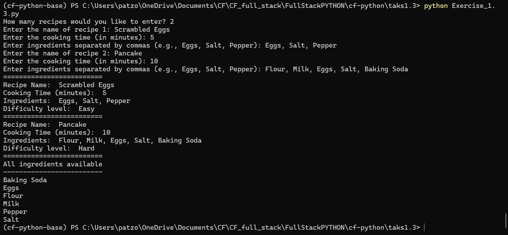

# Exercise 4 

## Part 1

### Table of Contents

1. [Importing the Pickle Module](#importing-the-pickle-module)
2. [Defining the 'take_recipe' Function](#defining-the-take-recipe-function)
3. [Defining the 'calculate_difficulty' Function](#defining-the-calc-difficulty-function)
4. [Attempting to Open a File](#attempting-to-open-a-file)
5. [Taking Additional Recipes](#taking-additional-recipes)
6. [Creating the Data Dictionary](#creating-the-data-dictionary)
7. [Saving Data to a File](#saving-data-to-a-file)

### Importing the Pickle Module

```python
import pickle
```

### Defining the 'take_recipe' Function

Define a function called `take_recipe()` to receive recipes from the user. This function performs the following tasks:

```python
# Function to input a recipe from the user
def take_recipe(recipe_number):
    name = input(f"Enter the name of recipe {recipe_number}: ")
    cooking_time = int(input("Enter the cooking time (in minutes): "))
    ingredients = input("Enter ingredients separated by commas (e.g., Eggs, Salt, Pepper): ").split(", ")
    
    recipe = {"name": name, "cooking_time": cooking_time, "ingredients": ingredients}
    recipes_list.append(recipe)
    
    # Add ingredients to the ingredients list, avoiding duplicates
    for ingredient in ingredients:
        if ingredient not in ingredients_list:
            ingredients_list.append(ingredient)
    
    return recipe
```

### Defining the 'calculate_difficulty' Function

Define the function `calculate_difficulty()`, which determines the recipe's difficulty based on specific criteria:

- If cooking time is less than 10 minutes and ingredients are less than 4, set difficulty to 'Easy'.
- If cooking time is less than 10 minutes and ingredients are 4 or more, set difficulty to 'Medium'.
- If cooking time is 10 minutes or more and ingredients are less than 4, set difficulty to 'Intermediate'.
- If cooking time is 10 minutes or more and ingredients are 4 or more, set difficulty to 'Hard'.

```python
# Function to calculate the difficulty of a recipe
def calculate_difficulty(recipe):
    if recipe["cooking_time"] < 10 and len(recipe["ingredients"]) < 4:
        recipe["difficulty"] = "Easy"
    elif recipe["cooking_time"] < 10 and len(recipe["ingredients"]) >= 4:
        recipe["difficulty"] = "Medium"
    elif recipe["cooking_time"] >= 10 and len(recipe["ingredients"]) < 4:
        recipe["difficulty"] = "Intermediate"
    else:
        recipe["difficulty"] = "Hard"

    return recipe
```

### Attempting to Open a File

```python
# Main code
filename = input("Enter the filename to save your recipe data: ")

try:
    # Try to open the file for reading
    with open(filename, 'rb') as file:
        # Load existing data from the file using pickle
        data = pickle.load(file)
        recipes_list = data.get("recipes_list", [])            
        ingredients_list = data.get("all_ingredients", [])      

except FileNotFoundError:
    # Handle the case when the file doesn't exist
    print(f"File '{filename}' not found. Initializing new data.")
    data = {"recipes_list": recipes_list, "all_ingredients": ingredients_list}
```

### Taking Additional Recipes

Ask the user how many recipes they want to enter and use a loop to call the take_recipe() function for each recipe.

```python
# Ask the user how many recipes they want to enter
num_recipes = int(input("How many recipes would you like to enter? "))

# Loop to take recipes from the user
for i in range(1, num_recipes + 1):
    recipe = take_recipe(i)
    # Calculate difficulty for the current recipe
    calculate_difficulty(recipe)  
```

### Creating the Data Dictionary

Gather the updated `recipes_list` and `all_ingredients` into a dictionary called `data`.

```python
# Update the data dictionary with the new lists
data["recipes_list"] = recipes_list
data["all_ingredients"] = ingredients_list
```

### Saving Data to a File

Open a user-defined binary file and save the `data` using the Pickle module.

```python
# Open the file and write the updated data using pickle
with open(filename, 'wb') as file:
    pickle.dump(data, file)

print(f"Recipe data saved to '{filename}'.")
```

## Part 2

### Table of Contents

1. [Importing the Pickle Module](#importing-the-pickle-module)
2. [Defining the 'Display Recipe' Function](#defining-the-display-recipe-function)
3. [Defining the 'Search Ingredient' Function](#defining-the-search-ingredient-function)
4. [Asking User for Recipe File](#asking-user-for-recipe-file)
5. [Attempting to Open User File](#attempting-to-open-user-file)
6. [Creating the Except Block](#creating-the-except-block)
7. [Creating the Else Block](#creating-the-else-block)

### Importing the Pickle Module

```python
import pickle
```

### Defining the 'Display Recipe' Function

Define a function that takes a recipe dictionary as an argument and displays its attributes, including name, cooking time, ingredients, and difficulty.

```python
# Function to display a recipe
def display_recipe(recipe):
    print("Recipe Name:", recipe["name"])
    print("Cooking Time (minutes):", recipe["cooking_time"])
    print("Ingredients:", ", ".join(recipe["ingredients"]))
    print("Difficulty:", recipe["difficulty"])
    print() 
```

### Defining the 'Search Ingredient' Function

Define a function that takes a data dictionary as an argument.

```python
# Function to search for an ingredient in the data
def search_ingredient(data):
    # Print all available ingredients 
    print("Available Ingredients:")
    for index, ingredient in enumerate(data["all_ingredients"], 1):
        print(f"{index}. {ingredient}")
    
    try:
        # Prompt user to select an ingredient
        ingredient_index = int(input("Enter the number of the ingredient to search: "))
        
        # Check if the selected index is valid
        if 1 <= ingredient_index <= len(data["all_ingredients"]):
            ingredient_searched = data["all_ingredients"][ingredient_index - 1]
            print(f"Searching for recipes containing '{ingredient_searched}':\n")
            
            # Loop through recipes and display the ones containing the ingredient
            for recipe in data["recipes_list"]:
                if ingredient_searched in recipe["ingredients"]:
                    display_recipe(recipe)
        else:
            print("Invalid input. Please enter a valid ingredient number.")
    
    except ValueError:
        print("Invalid input. Please enter a valid number.")
```

### Asking User for Recipe File

Prompt the user for the filename containing recipe data.

```python
# Main code
filename = input("Enter the filename containing your recipe data: ")
```

### Attempting to Open User File

Implement a try block to open the user-specified file and extract its contents into `data` using the Pickle module.

```python
try:
    # Try to open the file for reading using a 'with' statement
    with open(filename, 'rb') as file:
        # Load existing data from the file using pickle
        data = pickle.load(file)
```

### Creating the Except Block

Handle exceptions if the try block fails and inform the user that the file was not found.

```python
except FileNotFoundError:
    # Handle the case when the file doesn't exist
    print(f"File '{filename}' not found. Please make sure the file exists.")
except Exception as e:
    print(f"An error occurred while opening the file: {e}")
```

### Creating the Else Block

Define an else block that calls the `search_ingredient()` function, passing `data` as an argument.

```python
else:
    # Call the search_ingredient function with the loaded data
    search_ingredient(data)
```

## Part 3

### Running the Input Script

Execute "recipe_input.py" and enter sample recipes. Ensure that the script can generate a binary file upon execution.

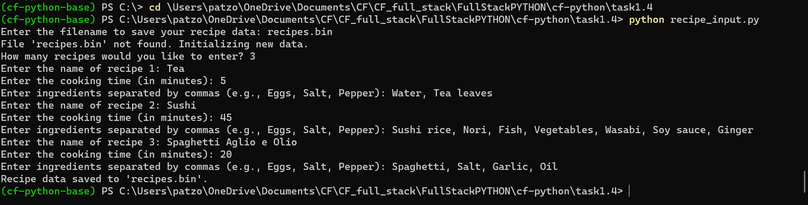

### Running the Search Script

Execute "recipe_search.py," enter the ingredient to be searched for, and verify that it produces the desired output with relevant recipes.


# Exercise 5

### Table of Contents

1. [Define Recipe Class](#define-recipe-class)
2. [Define Methods](#define-methods)
3. [Create Recipe Search Method](#create-recipe-search-method)
4. [Create Objects](#create-object)
5. [Create Recipes List](#create-recipes-list)
6. [Search and display Recipes](#search-and-display-recipes)
7. [Run the Script](#run-the-script)

### Define Recipe Class

Define a class called `Recipe`, which represents recipes with attributes like name, ingredients, cooking time, and difficulty.

```python
# Define a class - recipe
class Recipe:
    def __init__(self, name, cooking_time):
        self.name = name
        self.ingredients = []
        self.cooking_time = cooking_time
        self.difficulty = None

    # Class variable to keep track of all ingredients
    all_ingredients = set()
```

### Define Methods

Define various methods within the `Recipe` class for getting and setting attributes, adding ingredients, and calculating difficulty.

```python
   # Get and set methods for name and cooking_time
    def get_name(self):
        return self.name
    
    def set_name(self, name):
        self.name = name

    def get_cooking_time(self):
        return self.cooking_time
    
    def set_cooking_time(self, cooking_time):
        self.cooking_time = cooking_time

    # Method to add ingredients
    def add_ingredients(self, *ingredients):
        self.ingredients.extend(ingredients)
        self.update_all_ingredients()

    # Get method for ingredients
    def get_ingredients(self):
        return self.ingredients
    
    # Method to calculate difficulty based on cooking time and number of ingredients
    def calculate_difficulty(self):
        if self.cooking_time < 10 and len(self.ingredients) < 4:
            self.difficulty = "Easy"
        elif self.cooking_time < 10 and len(self.ingredients) >= 4:
            self.difficulty = "Medium"
        elif self.cooking_time >= 10 and len(self.ingredients) < 4:
            self.difficulty = "Intermediate"
        else:
            self.difficulty = "Hard"

    # Get method for difficulty
    def get_difficulty(self):
        if not self.difficulty:
            self.calculate_difficulty()
        return self.difficulty
    
    # Search for a specific ingredient in the recipe's ingredients
    def search_ingredient(self, ingredient):
        return ingredient in self.ingredients

    # Update the class-level set variable with all unique ingredients across recipes
    def update_all_ingredients(self):
        Recipe.all_ingredients.update(self.ingredients)

    ## String representation of the recipe
    def __str__(self):
        ingredients_str = ", ".join(self.ingredients)
        return "Recipe: " + self.name + "\nIngredients: " + ingredients_str + "\nCooking time: " + str(self.cooking_time) + " minutes\nDifficulty: " + self.get_difficulty()
```

### Create Recipe Search Method

Implement a `recipe_search()` method that allows searching for recipes based on specific ingredients.

```python
    # Method to search for recipes by searching for a specific ingredient
    def recipe_search(data, search_item):
        found_recipes = []
        for recipe in data:
            if recipe.search_ingredient(search_item):
                found_recipes.append(recipe)
        return found_recipes
```

### Create recipes objects

Create instances of the `Recipe` class for different recipes like tea, coffee, cake, etc.

```python
# Create recipe objects
tea = Recipe('Tea', 5)
tea.add_ingredients('Tea Leaves', 'Milk', 'Water')

coffee = Recipe('Coffee', 5)
coffee.add_ingredients('Coffee', 'Sugar', 'Water')

cake = Recipe('Cake', 50)
cake.add_ingredients('Sugar', 'Butter', 'Eggs', 'Vanilla Essence', 'Flour', 'Baking Powder', 'Milk')

banana_smoothie = Recipe('Banana Smoothie', 5)
banana_smoothie.add_ingredients('Bananas', 'Milk', 'Peanut Butter', 'Sugar', 'Ice Cubes')

musaka = Recipe('Musaka', 60)
musaka.add_ingredients('Potatoes', 'Chopped pork', 'Eggs', 'Sour Milk', 'Flour', 'Salt', 'Pepper', 'Tomato paste', 'Onion')
```

### Create Recipes List

Wrap the recipes into a list called `recipes_list`.

```python
# Create a list of recipes
recipes_list = [tea, coffee, cake, banana_smoothie, musaka]
```
### Search for Recipes and siplay all recipes, as well as recipes based on ingredients

Utilize the `recipe_search()` method to search for recipes containing specific ingredients like Water, Sugar, Bananas, and Potatoes. Then display the recipes found, as well as all recipes.

```python
# Search for recipes containing specific ingredients
water_recipes = recipe_search(recipes_list, 'Water')
sugar_recipes = recipe_search(recipes_list, 'Sugar')
banana_recipes = recipe_search(recipes_list, 'Bananas')
potato_recipes = recipe_search(recipes_list, 'Potatoes')

# Display the str representation of each recipe
for recipe in recipes_list:
    print(recipe)
    print()

# Display recipes containing specific ingredients
print("Recipes containing Water:")
for recipe in water_recipes:
    print(recipe)
    print()

print("Recipes containing Sugar:")
for recipe in sugar_recipes:
    print(recipe)
    print()

print("Recipes containing Bananas:")
for recipe in banana_recipes:
    print(recipe)
    print()

print("Recipes containing Potatoes:")
for recipe in potato_recipes:
    print(recipe)
    print()
```
### Run the Script

Run “recipe_oop.py”.

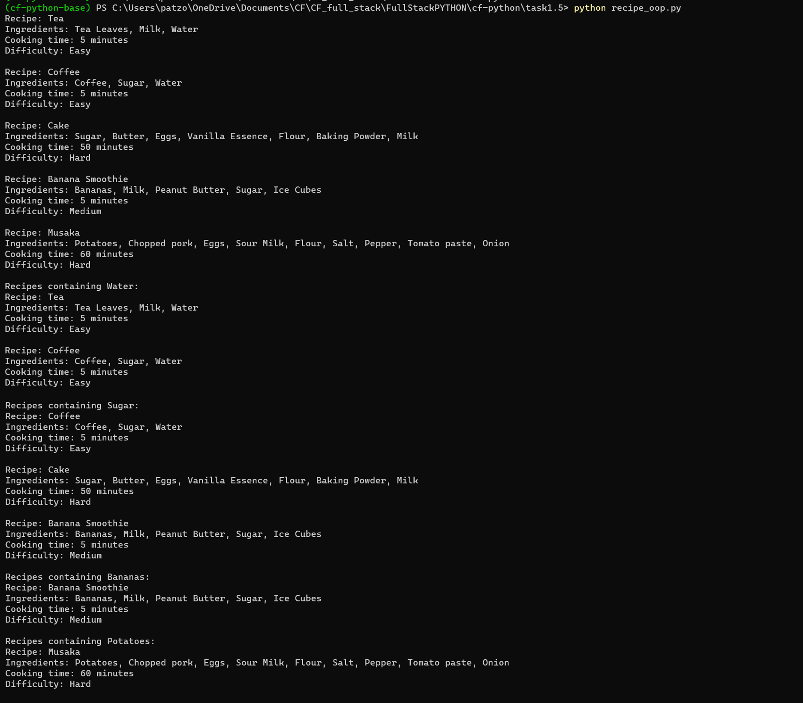

